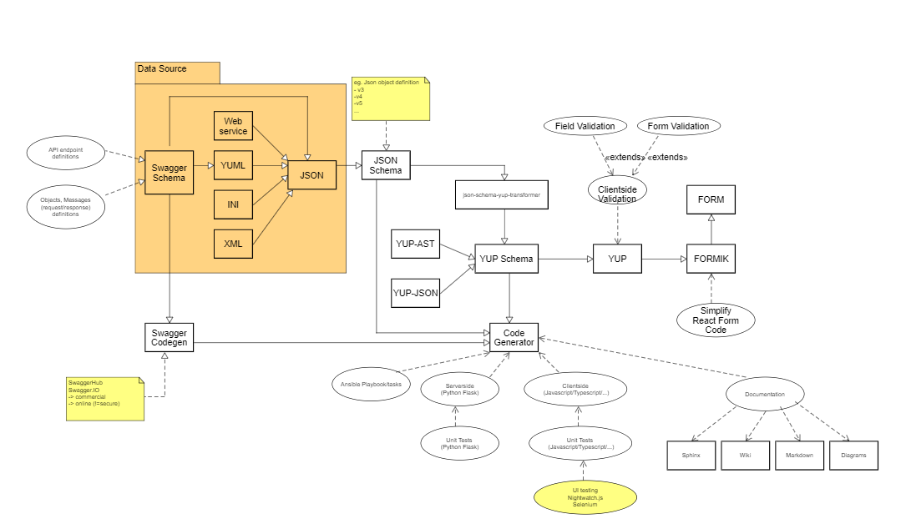

## formik-v2-tutorial-final

Source: https://codesandbox.io/s/formik-v2-tutorial-final-ge1pt

Uses `yup` and `yup-ast` library to define the form input validation rules

`AST` stands for 'Abstract syntax tree' -> see https://en.wikipedia.org/wiki/Abstract_syntax_tree

Library `json-schema-yup-transformer` [https://www.npmjs.com/package/json-schema-yup-transformer] is used to convert a json object schema to yup schema.

Use website https://www.jsonschemavalidator.net/ to validate your schema object

See example: https://codesandbox.io/s/zdlcl?file=/src/index.js:47-102

